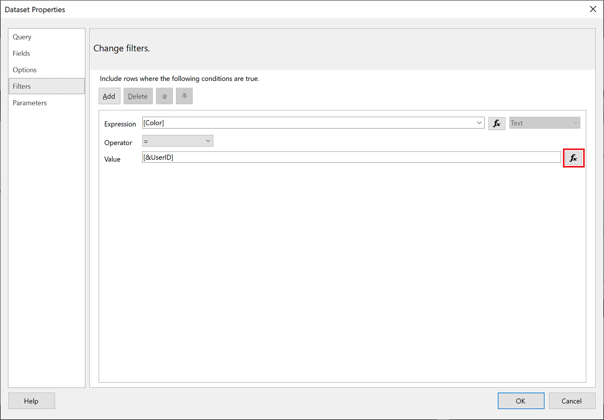
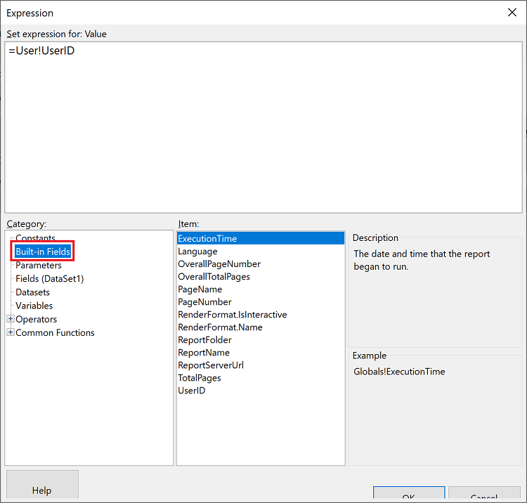
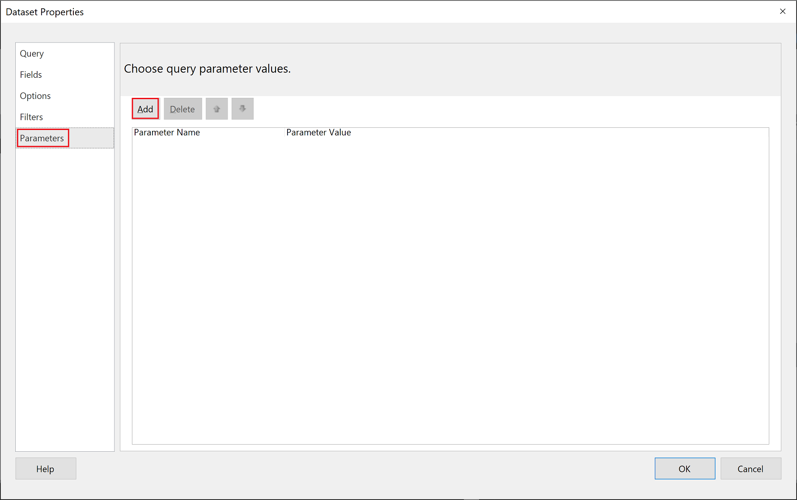
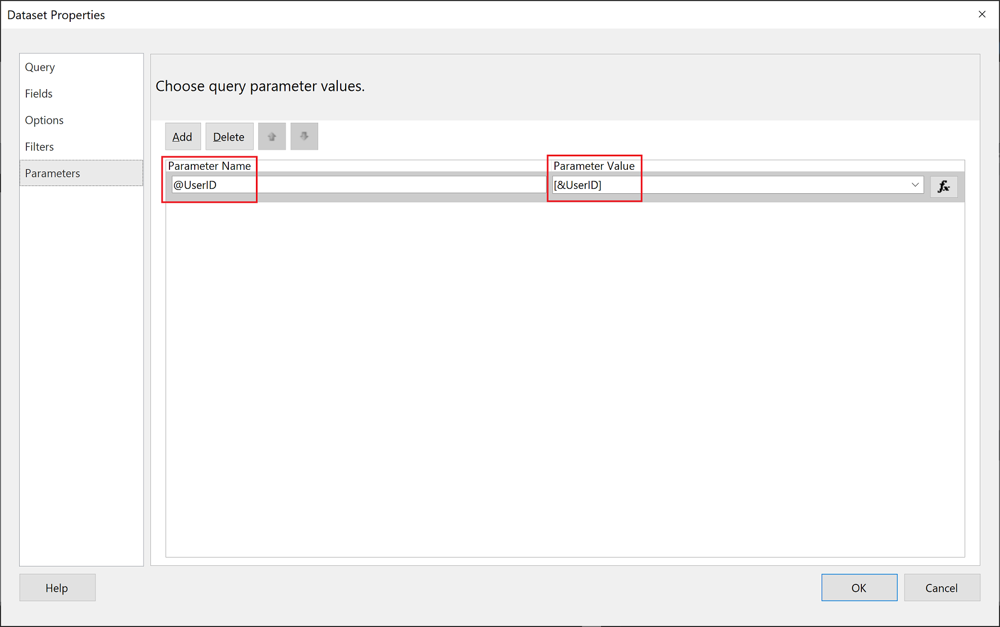

# Set up row-level security in Power BI paginated reports

This article explains how to set up row-level security (RLS) for paginated reports in Power BI. If your paginated report is based on a Power BI dataset, the article [Row-level security (RLS) with Power BI](../enterprise/service-admin-rls.md) provides a solid background.

To use RLS in a paginated report, you first [create parameters](#create-a-parameter-using-userid) in that report. Then you take advantage of the built-in field **UserID**:

- Use [UserID in a filter](#use-userid-in-a-filter).
- Use [UserID in a query](#use-userid-in-a-query).

## Prerequisites

- For [row-level security (RLS)](../enterprise/service-admin-rls.md) to work in Power BI Report Builder, You need at least a Viewer role in the dataset workspace, and Build permission for the dataset. Read about [roles in the new workspaces](../collaborate-share/service-roles-new-workspaces.md).
- You create paginated reports using the SQL Server Reporting Services engine, and not the Power BI (Analysis Services) engine, so you set up RLS filtering in [Power BI Report Builder](report-builder-power-bi.md).

## Create a parameter using UserID

To apply row-level security to a Power BI paginated report, the first step is to create a parameter and assign the built-in field **UserID**. See the article [Create parameters](report-builder-parameters.md) if you need help creating them. 

Then you use this parameter with **UserId** in a [*filter*](#use-userid-in-a-filter) or in a [*query*](#use-userid-in-a-query) to the data source.

## Use UserID in a filter

1. In the **Dataset Properties** window, from the left pane, select **Filter**.

    

1. From the **Expression** dropdown menu, select the parameter you want to use for filtering the data.

     

1. Select the **Value** function button.

    

1. In the **Expression** window, from the **Category** list, select **Built-in Fields**.

    

1. From the **Item** list, select **UserID** > **OK**.

    

1. In the **Dataset Properties** window, verify that the expression is *your selected parameter = UserID*.

    

1. Select **OK**.

## Use UserID in a query

1. In the **Dataset Properties** window, from the left navigation pane, select **Parameters**, then select **Add**.

    

1. In the **Parameter Name** field enter **\@UserID**, and in the **Parameter Value** add **[&UserID]**.

    

1. From the left pane, select  **Query**. In **Query**, add the **UserID** parameter as part of your query.

    This screenshot uses the color parameter as an example *(WHERE FinalTable.Color = @UserID)*. If needed, you can create a more complex query.

    

1. Select **OK**.

## Next steps

[Power BI Report Builder](report-builder-power-bi.md)