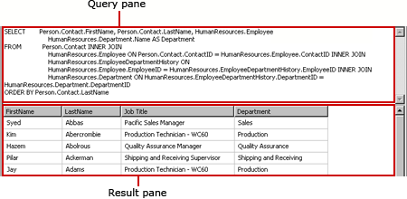
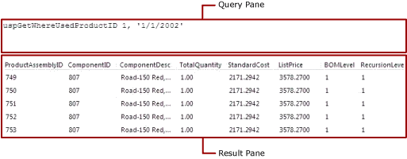

# Text-based query designer user interface (Power BI Report Builder)

[!INCLUDE [applies-yes-report-builder-no-desktop](../../includes/applies-yes-report-builder-no-desktop.md)]

  Use the text-based query designer to specify a query using the query language supported by the data source, run the query, and view the results at design time. You can specify multiple Transact-SQL statements, query or command syntax for custom data processing extensions, and queries that are specified as expressions. Because the text-based query designer does not preprocess the query and can accommodate any kind of query syntax, this is the default query designer tool for many data source types.  
  
> [!IMPORTANT]  
> Users access data sources when they create and run queries. You should grant minimal permissions on the data sources, such as read-only permissions.  
  
 The text-based query designer displays a toolbar and the following two panes:  
  
- **Query** Shows the query text, table name, or stored procedure name depending on the query type. Not all query types are available for all data source types. For example, table name is supported only for the data source type OLE DB.  
  
- **Result** Shows the results of running the query at design time.  
  
## Text-based query designer toolbar  
 The text-based query designer provides a single toolbar for all the command types. The following table lists each button on the toolbar and its function.  
  
|Button|Description|  
|------------|-----------------|  
|**Edit As Text**|Toggle between the text-based query designer and the graphical query designer. Not all data source types support graphical query designers.|  
|**Import**|Import an existing query from a file or report. Only file types `sql` and `rdl` are supported|  
||Run the query and display the result set in the Result pane.|  
|**Command Type**|Select **[Text](#command-type-text)**, **[StoredProcedure](#command-type-storedprocedure)**, or **TableDirect**. If a stored procedure has parameters, the **Define Query Parameters** dialog box appears when you select **Run** on the toolbar, and you can fill in values as needed. Support for command type varies by data source type. For example, only OLE DB and ODBC support **TableDirect**.<br /><br /> Note: If a stored procedure returns more than one result set, only the first result set is used to populate the dataset.|  
  
## Command type Text

 When you create a SQL Server dataset, the relational query designer opens by default. To switch to the text-based query designer, select the **Edit As Text** toggle button on the toolbar. The text-based query designer presents two panes: the Query pane and the Result pane. The following figure labels each pane.  
  
   
  
 The following table describes the function of each pane.  
  
|Pane|Function|  
|----------|--------------|  
|Query|Displays the Transact-SQL query text. Use this pane to write or edit a Transact-SQL query.|  
|Result|Displays the results of the query. To run the query, right-click in any pane and select **Run**, or select the **Run** button on the toolbar.|  
  
### Example

 The following query returns the list of names from the  AdventureWorks2014 database **ContactType** table for the **Person** schema.  
  
```  
SELECT Name FROM Person.ContactType  
```  
  
 When you select **Run** on the toolbar, the command in the **Query** pane runs and the results are displayed in the **Result** pane. The result set displays a list of 20 types of contacts, for example, Owner or Sales Agent.  
  
## Command type StoredProcedure

 When you select **Command typeStoredProcedure**, the text-based query designer presents two panes: the Query pane and the Result pane. Enter the stored procedure name in the Query pane and select **Run** on the toolbar. If the stored procedure uses parameters, the **Define Query Parameters** dialog box opens. Enter the parameter values for the stored procedure. A report parameter is created for every stored procedure input parameter.  
  
 The following figure shows the Query and Results panes when you run a stored procedure. In this case, the input parameters are constants.  
  
   
  
 The following table describes the function of each pane.  
  
|Pane|Function|  
|----------|--------------|  
|Query|Displays the name of the stored procedure and any input parameters.|  
|Result|Displays the results of the query. To run the query, right-click in any pane and select **Run**, or select the **Run** button on the toolbar.|  
  
### Example

 The following query calls the AdventureWorks2014 stored procedure **uspGetWhereUsedProductID**. You must enter a value for the product identification number parameter when you run the query.  
  
```  
uspGetWhereUsedProductID  
```  
  
 Select the **Run** (**!**) button. When prompted for the query parameters, use the following table to enter values.  
  
|Parameter|Value|  
|-|-|  
|*\@StartProductID*|820|  
|*\@CheckDate*|20010115|  
  
 For the specified date, the result set displays a list of 13 product identifiers that used the specified component number.  
  
## Command type TableDirect

 When you select **Command typeTableDirect**, the text-based query designer presents two panes: the Query pane and the Result pane. When you enter a table and select the **Run** button, all the columns for that table are returned.  
  
### Example

 For a data source type OLE DB, the following dataset query returns a result set for all contact types in the AdventureWorks2014 database.  
  
 `Person.ContactType`  
  
 When you enter the table name Person.ContactType, it is the equivalent of creating the Transact-SQL statement `SELECT * FROM Person.ContactType`.  
  
## See also

 [Power BI Report Builder](../report-builder-power-bi.md)  
