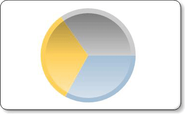
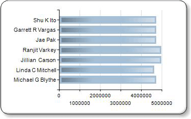

# Chart effects - add bevel, emboss, or texture to a paginated report chart (Power BI Report Builder)

[!INCLUDE [applies-yes-report-builder-no-desktop](../../../includes/applies-yes-report-builder-no-desktop.md)]

  When using certain chart types in a Power BI paginated report, you can specify a drawing effect to increase the visual impact of your chart. These drawing effects are only applied to the series of your chart. They have no effect on any other chart element.  
  
 When you are using any variant of a pie or doughnut chart, you can specify a soft edge or concave drawing style, similar to bevel or emboss effects that can be applied to an image.  
  
 When you are using any variant of a bar or column chart, you can apply texture styles, such as cylinder, wedge, and light-to-dark, to the individual bars or columns.  
  
 In addition to these drawing styles, you can add borders and shadows to many chart elements to give the illusion of depth. For more information on other ways to format the chart, see [Formatting a Chart &#40;Power BI Report Builder&#41;](formatting-chart-report-builder.md).  
  
 
  
### Add bevel or emboss styles to a pie or doughnut chart  
  
1.  On the **View** tab, select **Properties** to open the Properties pane.  
  
2.  Select the pie or doughnut chart that you want to enhance. Select a data field in the chart, not the entire chart.  
  
3.  In the Properties pane, expand the **CustomAttributes** node.  
  
4.  For PieDrawingStyle, select a style from the drop-down list.  
  
> [!NOTE]  
>  You can't have 3D and bevel or emboss styles on the same chart. If you have enabled 3D for the chart, you will not see the PieDrawingStyle property.  
  
   
  
### Add texture styles to a bar or column chart  
  
1.  Select the bar or column chart that you want to enhance. Select a data field in the chart, not the entire chart.  
  
2.  Open the Properties pane.  
  
3.  Expand the **CustomAttributes** node.  
  
4.  For DrawingStyle, select a style from the drop-down list.  
  
> [!NOTE]  
>  You can't have 3D and bevel or emboss styles on the same chart. If you have enabled 3D for the chart, you will not see the PieDrawingStyle property.  
  
   
  
## Next steps  
 [Bar Charts &#40;Power BI Report Builder&#41;](bar-charts-report-builder.md)   
 [Column Charts &#40;Power BI Report Builder&#41;](/sql/reporting-services/report-design/column-charts-report-builder-and-ssrs)   
 [Pie Charts &#40;Power BI Report Builder&#41;](/sql/reporting-services/report-design/pie-charts-report-builder-and-ssrs)   
 [Formatting a Chart &#40;Power BI Report Builder&#41;](formatting-chart-report-builder.md)  
  
  
