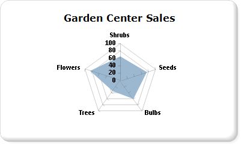

# Polar charts in Power BI paginated report (Power BI Report Builder)

[!INCLUDE [applies-yes-report-builder-no-desktop](../../../includes/applies-yes-report-builder-no-desktop.md)]

  A polar chart in a Power BI paginated report displays a series as a set of points that are grouped by category on a 360-degree circle. Values are represented by the length of the point as measured from the center of the circle. The farther the point is from the center, the greater its value. Category labels are displayed on the perimeter of the chart. For more information on how to add data to a polar chart, see [Charts (Power BI Report Builder)](charts-report-builder.md).  
  
You create and modify Power BI paginated reports in [Power BI Report Builder](../../report-builder-power-bi.md). 
  
## Variations  
  
- **Radar chart**. A radar chart displays a series as a circular line or area. Unlike the polar chart, the radar chart does not display data in terms of polar coordinates.  
  
## Data considerations for polar charts  
  
- The radar chart is useful for comparisons between multiple series of category data.  
  
- Polar charts are most commonly used to graph polar data, where each data point is determined by an angle and a distance.  
  
- Polar charts cannot be combined with any other chart type in the same chart area.  
  
## Example

 The following example shows how a radar chart can be used. The table below provides sample data for the chart.  
  
|Name|Sales|  
|----------|-----------|  
|Shrubs|61|  
|Seeds|78|  
|Bulbs|60|  
|Trees|38|  
|Flowers|81|  
  
 In this example, the Name field is placed in the Category Groups area. The Sales field is placed in the Values area. The Sales field is automatically aggregated for the chart when you drop it. The radar chart calculates where to place the labels based on the number of values in the Sales field, which contains five values and places labels at five equidistant points on a circle. If the Sales field contained three values, the labels would be placed at three equidistant points on a circle.  
  
 The following illustration shows an example of a radar chart based on the data presented.  
  
   
  
## Next steps

 [Charts (Power BI Report Builder)](charts-report-builder.md)   
 [Formatting a chart &#40;Power BI Report Builder&#41;](formatting-chart-report-builder.md)   
 [Chart types &#40;Power BI Report Builder&#41;](/sql/reporting-services/report-design/chart-types-report-builder-and-ssrs)   
 [Line charts &#40;Power BI Report Builder&#41;](/sql/reporting-services/report-design/line-charts-report-builder-and-ssrs)   
 [Empty and null data points in charts &#40;Power BI Report Builder&#41;](/sql/reporting-services/report-design/empty-and-null-data-points-in-charts-report-builder-and-ssrs)  
  
  
