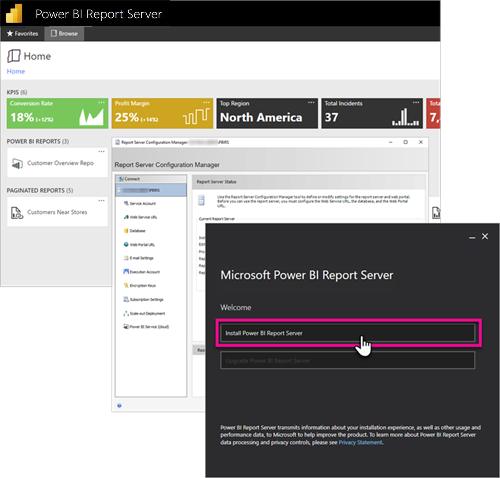

# Developer handbook overview, Power BI Report Server

Welcome to the developer handbook for Power BI Report Server, an on-premises location for storing and managing your Power BI, mobile, and paginated reports.



This handbook highlights options you have, as a developer, to work with Power BI Report Server.

## Embedding

For any report within Power BI Report Server, you can embed within an iFrame by adding the querystring parameter `?rs:Embed=true` to the URL. This technique works with Power BI reports as well as other report types.

### Report Viewer Control

For paginated reports, you can take advantage of the Report Viewer Control. With it, you can place the control within a .NET windows or web application. For more information, see [Get started with the Report Viewer Control](/sql/reporting-services/application-integration/integrating-reporting-services-using-reportviewer-controls-get-started).

## APIs

You have several API options for interacting with Power BI Report Server. This technique includes the following.

* [REST APIs](rest-api.md)
* [URL Access](/sql/reporting-services/url-access-ssrs)
* [WMI Provider](/sql/reporting-services/wmi-provider-library-reference/reporting-services-wmi-provider-library-reference-ssrs)

You can also use the open-source [PowerShell utilities](https://github.com/Microsoft/ReportingServicesTools) to manage your report server.

> [!NOTE]
> The PowerShell utilities support Power BI Desktop files (.pbix) via the -RsRest* commands.

Run the following command to find which commands in the ReportingServicesTools PowerShell module support Power BI Desktop files (.pbix).

```powershell
Get-Command -Module ReportingServicesTools -Noun RsRest*
```

## Custom extensions

The Extension Library is a set of classes, interfaces, and value types that are included in Power BI Report Server. This library provides access to system functionality and is designed to be the foundation on which Microsoft .NET Framework applications can be used to extend Power BI Report Server components.

There are several types of extensions you can build.

* Data processing extensions
* Delivery extensions
* Rendering extensions for paginated reports
* Security extensions

To learn more, see [Extension library](/sql/reporting-services/extensions/reporting-services-extension-library).

## Next steps

[Get started with the Report Viewer Control](/sql/reporting-services/application-integration/integrating-reporting-services-using-reportviewer-controls-get-started)  
[Building Applications Using the Web Service and the .NET Framework](/sql/reporting-services/report-server-web-service/net-framework/building-applications-using-the-web-service-and-the-net-framework)  
[URL Access](/sql/reporting-services/url-access-ssrs)  
[Extension library](/sql/reporting-services/extensions/reporting-services-extension-library)  
[WMI Provider](/sql/reporting-services/wmi-provider-library-reference/reporting-services-wmi-provider-library-reference-ssrs)

More questions? [Try asking the Power BI Community](https://community.powerbi.com/)
