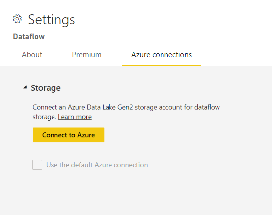
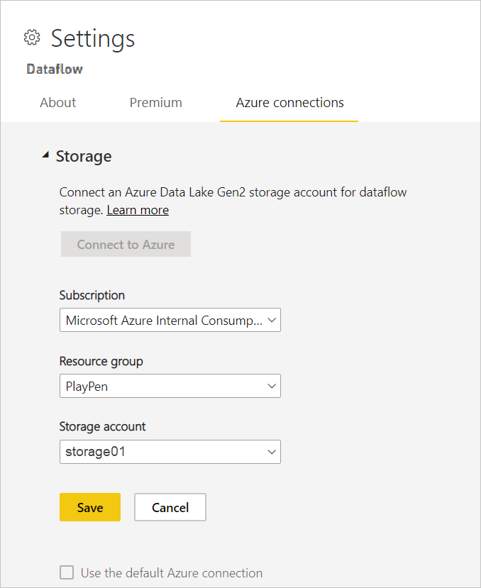

# Configuring dataflow storage to use Azure Data Lake Gen 2 

Data used with Power BI is stored in internal storage provided by Power BI by default. With the integration of dataflows and Azure Data Lake Storage Gen 2 (ADLS Gen2), you can store your dataflows in your organization's Azure Data Lake Storage Gen2 account.

There are two ways to configure which ADLS Gen 2 store to use: you can use a tenant assigned ADLS gen 2 account, or you can bring your own ADLS Gen 2 store at a workspace level. 

## Pre-requisites

To bring your own ADLS Gen 2 account, you must have owner permissions at either the storage account, resource group or subscription layer. If you are an administrator, you still must assign yourself owner permission. 

The storage account must be created with the [Hierarchical Namespace (HNS)](/azure/storage/blobs/create-data-lake-storage-account) enabled. 

Also, the ADLS Gen 2 account must be deployed in the same region as your Power BI tenant. An error occurs if the locations of the resources are not in the same region.

Finally, you can connect to any ADLS gen 2 from the admin portal, but if you connect directly to a workspace, you must first ensure there are no dataflows in the workspace before connecting.

## Connecting to an Azure Data Lake Gen 2 at a workspace
Navigate to a workspace that has no dataflows. Select **Workspace settings** to a new tab called **Azure Connections**. Select the **Azure Connections** tab and then select the **Storage** section.

 
The **Use default Azure connection** option is  visible if the tenant has already configured ADLS Gen 2. You have two options: use the tenant configured ADLS gen 2 by selecting the box called **Use the default Azure connection**, or select **Connect to Azure** to point to a new Azure Storage account. 

When you select **Connect to Azure** Power BI retrieves a list of Azure subscriptions to which you have access. Fill in the dropdowns and select a valid Azure subscription, resource group, and storage account which has hierarchical namespace option enabled, which is the ADLS Gen2 flag.

 
Once selected, select **Save** and you now have successfully attached the workspace to your own ADLS Gen2 account. Power BI automatically configures the storage account with the required permissions, and sets up the Power BI filesystem to which  the data will be written. At this point, every dataflow’s data inside this workspace will write directly to this filesystem, which can be used with other Azure services, creating a single source for all of your organizational or departmental data.

## Detaching Azure Data Lake Gen 2 from a workspace or tenant

To remove a connection at a workspace level, you must first ensure all dataflows in the workspace are deleted. Once all the dataflows have been removed, select **Disconnect** in the workspace settings. The same applies for a tenant, but you must first ensure all workspaces have also been disconnected from the tenant storage account before you are able to disconnect at a tenant level.

## Disabling Azure Data Lake Gen 2

In the **Admin portal**, under **dataflows**, you can disable access for users to either use this feature, and can disallow workspace admins to bring their own Azure Storage.

## Next steps
The following articles provide more information about dataflows and Power BI:

* [Introduction to dataflows and self-service data prep](dataflows-introduction-self-service.md)
* [Creating a dataflow](dataflows-create.md)
* [Configure and consume a dataflow](dataflows-configure-consume.md)
* [Premium features of dataflows](dataflows-premium-features.md)
* [AI with dataflows](dataflows-machine-learning-integration.md)
* [Dataflows limitations and considerations](dataflows-features-limitations.md)
* [Dataflows best practices](dataflows-best-practices.md)