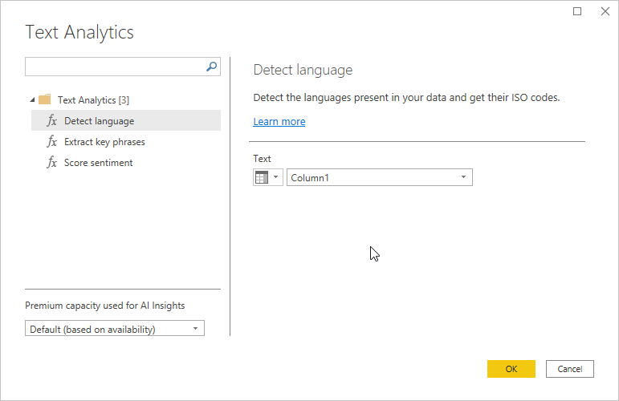
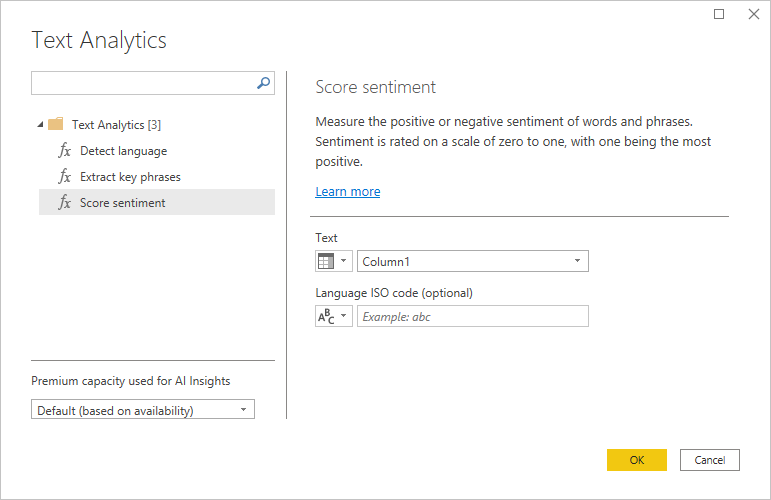
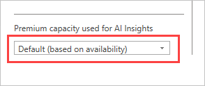

# Use AI Insights in Power BI Desktop

In Power BI, you can use AI Insights to gain access to a collection of pre-trained machine learning models that enhance your data preparation efforts. AI Insights is accessed in the **Power Query editor**, and its associated features and functions are accessed through the **Home** and **Add Column** tabs in **Power Query editor**. 

This article describes functions for Text Analytics and Vision functions, both from Azure Cognitive Services. Also in this article is a section that describes the custom functions available in Power BI from Azure Machine Learning.

## Using Text Analytics and Vision

With Text Analytics and Vision in Power BI, you can apply different algorithms from [Azure Cognitive Services](https://azure.microsoft.com/services/cognitive-services/) to enrich your data in Power Query.

The services that are supported today are the following:

* [Sentiment Analysis](/azure/cognitive-services/text-analytics/how-tos/text-analytics-how-to-sentiment-analysis)
* [Key Phrase Extraction](/azure/cognitive-services/text-analytics/how-tos/text-analytics-how-to-keyword-extraction)
* [Language Detection](/azure/cognitive-services/text-analytics/how-tos/text-analytics-how-to-language-detection)
* [Image Tagging](/azure/cognitive-services/computer-vision/concept-tagging-images). 

The transformations are executed on the Power BI service and do not require an Azure Cognitive Services subscription. 

> [!IMPORTANT]
> 
> Using the Text Analytics or Vision features requires Power BI Premium.

### Enabling Text Analytics and Vision on Premium capacities

Cognitive Services are supported for Premium capacity nodes EM2, A2, or P1 and above. Cognitive services are also available with a Premium Per User (PPU) license. A separate AI workload on the capacity is used to run Cognitive Services. During public preview of these features (prior to June 2019), this workload was disabled by default. Before using Cognitive Services in Power BI, the AI workload must be enabled in the **capacity settings** of the admin portal. You can turn on the **AI workload** in the **workloads** section and define the maximum amount of memory you would like this workload to consume. The recommended memory limit is 20%. Exceeding this limit causes the query to slow down.

### Available functions

This section describes the available functions in Cognitive Services in Power BI.

#### Detect language

The language detection function evaluates text input, and for each field, returns the language name and ISO identifier. This function is useful for data columns that collect arbitrary text, where language is unknown. The function expects data in text format as input.

Text Analytics recognizes up to 120 languages. For more information, see [supported languages](/azure/cognitive-services/text-analytics/text-analytics-supported-languages).

#### Extract key phrases

The **Key Phrase Extraction** function evaluates unstructured text, and for each text field, returns a list of key phrases. The function requires a text field as input, and accepts an optional input for **Culture info**.

Key phrase extraction works best when you give it bigger chunks of text to work on. This is opposite from sentiment analysis, which performs better on smaller blocks of text. To get the best results from both operations, consider restructuring the inputs accordingly.

#### Score sentiment

The **Score Sentiment** function evaluates text input and returns a sentiment score for each document, ranging from 0 (negative) to 1 (positive). This function is useful for detecting positive and negative sentiment in social media, customer reviews, and discussion forums.

Text Analytics uses a machine learning classification algorithm to generate a sentiment score between 0 and 1. Scores closer to 1 indicate positive sentiment, scores closer to 0 indicate negative sentiment. The model is pre-trained with an extensive body of text with sentiment associations. Currently, it's not possible to provide your own training data. The model uses a combination of techniques during text analysis, including text processing, part-of-speech analysis, word placement, and word associations. For more information about the algorithm, see [Introducing Text Analytics](/archive/blogs/machinelearning/machine-learning-and-text-analytics).

Sentiment analysis is performed on the entire input field, as opposed to extracting sentiment for a particular entity in the text. In practice, there's a tendency for scoring accuracy to improve when documents contain one or two sentences rather than a large block of text. During an objectivity assessment phase, the model determines whether an input field as a whole is objective or contains sentiment. An input field that is mostly objective does not progress to the sentiment detection phrase, resulting in a .50 score, with no further processing. For input fields continuing in the pipeline, the next phase generates a score above or below .50, depending on the degree of sentiment detected in the input field.

Currently, Sentiment Analysis supports English, German, Spanish, and French. Other languages are in preview. For more information, see [supported languages](/azure/cognitive-services/text-analytics/text-analytics-supported-languages).

#### Tag images

The **Tag Images** function returns tags based on more than two thousand recognizable objects, living beings, scenery, and actions. When tags are ambiguous or not common knowledge, the output provides *hints* to clarify the meaning of the tag in context of a known setting. Tags are not organized as a taxonomy and no inheritance hierarchies exist. A collection of content tags forms the foundation for an image *description* displayed as human readable language formatted in complete sentences.

After uploading an image or specifying an image URL, Computer Vision algorithms output tags based on the objects, living beings, and actions identified in the image. Tagging is not limited to the main subject, such as a person in the foreground, but also includes the setting (indoor or outdoor), furniture, tools, plants, animals, accessories, gadgets, and so on.

This function requires an image URL or a base-64 field as input. At this time, image tagging supports English, Spanish, Japanese, Portuguese, and Simplified Chinese. For more information, see [supported languages](/java/api/com.microsoft.azure.cognitiveservices.vision.computervision.computervision.tagimage#azure-java-stable).

### Invoking Text Analytics or Vision functions in Power Query

To enrich your data with Text Analytics or Vision functions, open **Power Query editor**. This example walks through scoring the sentiment of a text. The same steps can be used to extract key phrases, detect language, and tag images.

Select the **Text analytics** button in the **Home** or **Add column** ribbon. You'll be prompted to sign in.

After signing in, select the function you want to use and the data column you want to transform in the pop-up window.

Power BI selects a Premium capacity to run the function on and send the results back to Power BI Desktop. The selected capacity is only used for Text Analytics and Vision function during application and refreshes in Power BI Desktop. Once the report is published, refreshes run on the Premium capacity of the workspace the report is published to. You can change the capacity used for all Cognitive Services in the dropdown in the lower left corner of the popup window.

**Cultureinfo** is an optional input to specify the language of the text. This field is an ISO code. You can use a column as input for Cultureinfo, or a static field. In this example, the language is specified as English (en) for the whole column. If you leave this field blank, Power BI automatically detects the language before applying the function. Next, select **Apply.**

The first time you use AI Insights on a new data source, you're prompted to set the privacy level of your data.

> [!NOTE]
> Refreshes of the dataset in Power BI will only work for data sources where the privacy level is set to public or organizational.

After invoking the function, the result is added as a new column to the table. The transformation is also added as an applied step in the query.

In the cases of image tagging and key phrase extraction, the results can return multiple values. Each individual result is returned on a duplicate of the original row.

### Publishing a report with Text Analytics or Vision functions

While editing in Power Query and performing refreshes in Power BI Desktop, Text Analytics and Vision use the Premium capacity that was selected in Power Query editor. After publishing the report to Power BI, it uses the Premium capacity of the workspace into which it was published.

Reports with applied Text Analytics and Vision functions should be published to a workspace that is not on a Premium capacity, otherwise refreshing the dataset will fail.

### Managing impact on a Premium capacity

The following sections describe how you can manage the impacts of Text Analytics and Vision on capacity.

#### Selecting a capacity

Report authors can select which Premium capacity on which to run AI Insights. By default, Power BI selects the first created capacity to which the user has access.

#### Monitoring with the Capacity Metrics app

Premium capacity owners can monitor the impact of Text Analytics and Vision functions on a capacity with the [Power BI Premium Capacity Metrics app](../admin/service-admin-premium-monitor-capacity.md). The app provides detailed metrics on the health of the AI workloads within your capacity. The top chart shows the memory consumption by AI workloads. Premium capacity admins can set the memory limit for the AI workload per capacity. When memory usage reaches the memory limit, you can consider increasing the memory limit or moving some workspaces to a different capacity.

### Comparing Power Query and Power Query Online

The Text Analytics and Vision functions used in Power Query and Power Query Online are the same. The only differences between the experiences are the following:

* Power Query has separate buttons for Text Analytics, Vision, and Azure Machine Learning. In Power Query Online, these are combined in one menu.
* In Power Query, the report author can select the Premium capacity that is used to run the functions. This is not required in Power Query Online, since a dataflow is already on a specific capacity.

### Considerations and limitations of Text Analytics

There are a few considerations and limitations to keep in mind when using Text Analytics.

* Incremental refresh is supported but can cause performance issues when used on queries with AI insights.
* Direct Query is not supported.

## Using Azure ML

Numerous organizations use **Machine Learning** models for better insights and predictions about their business. The ability to visualize and invoke insights from these models, in your reports and dashboards and other analytics, can help disseminate these insights to the business users who need it the most. Power BI makes it simple to incorporate the insights from models hosted on Azure Machine Learning, using straightforward point-and-click gestures.

To use this capability, a data scientist can simply grant access to the Azure ML model to the BI analyst using the Azure portal. Then, at the start of each session, Power Query discovers all the Azure ML models to which the user has access and exposes them as dynamic Power Query functions. The user can then invoke those functions by accessing them from the ribbon in Power Query editor, or by invoking the M function directly. Power BI also automatically batches the access requests when invoking the Azure ML model for a set of rows to achieve better performance.

This functionality is supported in Power BI Desktop, Power BI dataflows, and for Power Query Online in the Power BI service.

To learn more about dataflows, see [Self-service data prep in Power BI](./dataflows/dataflows-introduction-self-service.md).

To learn more about Azure Machine Learning, see the following articles:

- Overview: [What is Azure Machine Learning?](/azure/machine-learning/service/overview-what-is-azure-ml)
- Quick Starts and Tutorials for Azure Machine Learning: [Azure Machine Learning Documentation](/azure/machine-learning/)

### Granting access to an Azure ML model

To access an Azure ML model from Power BI, the user must have **Read** access to the Azure subscription. In addition, they must have the following:

- For Machine Learning Studio (classic) models, **Read** access to Machine Learning Studio (classic) web service
- For Machine Learning models, **Read** access to the Machine Learning workspace

The steps in this section describe how to grant a Power BI user access to a model hosted on the Azure ML service, so they can access this model as a Power Query function. For further details, please see [Manage access using RBAC and the Azure portal](/azure/role-based-access-control/role-assignments-portal).

1. Sign in to the [Azure portal](https://portal.azure.com/).
2. Go to the **Subscriptions** page. You can find the **Subscriptions** page through the **All Services** list in the left navigation menu of the Azure portal.
3. Select your subscription
4. Select **Access control (IAM)**, and then select the **Add** button.
5. Select **Reader** as the Role. Select the Power BI user to whom you wish to grant access to the Azure ML model.
6. Select **Save**
7. Repeat steps three through six to grant **Reader** access to the user for the specific Machine Learning Studio (classic) web service, *or* the Machine Learning workspace hosting the model.

### Schema discovery for Machine Learning models

Data scientists primarily use Python to develop, and even deploy, their machine learning models for Machine Learning. Unlike the Machine Learning Studio (classic), which helps automate the task of creating a schema file for the model, in the case of Machine Learning, the data scientist must explicitly generate the schema file using Python.

This schema file must be included in the deployed web service for Machine Learning models. To automatically generate the schema for web service, you must provide a sample of the input/output in the entry script for the deployed model. Please see the subsection on [(Optional) Automatic Swagger schema generation in the Deploy models with the Azure Machine Learning](/azure/machine-learning/how-to-deploy-and-where#optional-define-model-web-service-schema) service documentation. The link includes the example entry script with the statements for the schema generation.

Specifically, the _@input\_schema_ and _@output\_schema_ functions in the entry script reference the input and output sample formats in the _input\_sample_ and _output\_sample_ variables, and use these samples to generate an OpenAPI (Swagger) specification for the web service during deployment.

These instructions for schema generation by updating the entry script must also be applied to models created using automated machine learning experiments using the Azure Machine Learning SDK.

> [!NOTE]
> Models created using the Azure Machine Learning visual interface do not currently support schema generation, but will in subsequent releases.
> 
### Invoking an Azure ML model in Power Query

You can invoke any Azure ML model to which you have been granted access, directly from the Power Query Editor. To access the Azure ML models, select **Azure Machine Learning** button in the **Home** or **Add Column** ribbon in the Power Query editor.

All Azure ML models to which you have access are listed here as Power Query functions. Also, the input parameters for the Azure ML model are automatically mapped as parameters of the corresponding Power Query function.

To invoke an Azure ML model, you can specify any of the selected entity's columns as an input from the drop-down. You can also specify a constant value to be used as an input by toggling the column icon to the left of the input dialog.

Select **OK** to view the preview of the Azure ML model's output as a new column in the entity table. You will also see the model invocation as an applied step for the query.

If the model returns multiple output parameters, they are grouped together as a record in the output column. You can expand the column to produce individual output parameters in separate columns.

### Considerations and limitations of Azure ML

The following considerations and limitations apply to Azure ML in Power BI Desktop.

* Models created using the Azure Machine Learning visual interface do not currently support schema generation. Support is anticipated in subsequent releases.
* Incremental refresh is supported but can cause performance issues when used on queries with AI insights.
* Direct Query is not supported.

## Next steps

This article provided an overview of integrating Machine Learning into Power BI Desktop. The following articles might also be interesting and useful.

- [Tutorial: Consume Azure Machine Learning models in Power BI](../connect-data/service-aml-integrate.md)
- [Tutorial: Using Cognitive Services in Power BI](../connect-data/service-tutorial-use-cognitive-services.md)
- [Cognitive Services in Power BI](./dataflows/dataflows-machine-learning-integration.md)
- [Azure Machine Learning integration in Power BI](./dataflows/dataflows-machine-learning-integration.md)
- [Monitoring Premium capacities with the app](../admin/service-admin-premium-monitor-capacity.md)
- [AI metrics in the Premium capacity metrics app](https://powerbi.microsoft.com/blog/ai-metrics-now-available-in-power-bi-premium-capacity-metrics-app/)
