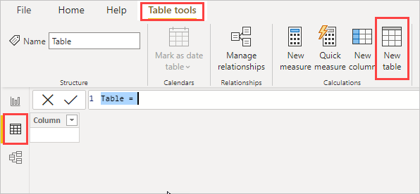

# Create calculated tables in Power BI Desktop
Most of the time, you create tables by importing data into your model from an external data source. But *calculated tables* let you add new tables based on data you've already loaded into the model. Instead of querying and loading values into your new table's columns from a data source, you create a [Data Analysis Expressions (DAX)](/dax/index) formula to define the table's values.

DAX is a formula language for working with relational data, like in Power BI Desktop. DAX includes a library of over 200 functions, operators, and constructs, providing immense flexibility in creating formulas to calculate results for just about any data analysis need. Calculated tables are best for intermediate calculations and data you want to store as part of the model, rather than calculating on the fly or as query results. For example, you might choose to *union* or *cross join* two existing tables.

Just like other Power BI Desktop tables, calculated tables can have relationships with other tables. Calculated table columns have data types, formatting, and can belong to a data category. You can name your columns whatever you want, and add them to report visualizations just like other fields. Calculated tables are recalculated if any of the tables they pull data from are refreshed or updated, unless the table uses data from a table that uses DirectQuery; in the case with DirectQuery, the table will only reflect the changes once the dataset has been refreshed. If a table needs to use DirectQuery, it's best to have the calculated table in DirectQuery as well.

## Create a calculated table

You create calculated tables by using the **New Table** feature in Report View or Data View of Power BI Desktop.

For example, imagine you're a personnel manager who has a table of **Northwest Employees** and another table of **Southwest Employees**. You want to combine the two tables into a single table called **Western Region Employees**.

**Northwest Employees**

 

**Southwest Employees**

 

In Report View or Data View of Power BI Desktop, in the **Calculations** group of the **Modeling** tab, select **New Table**. It's a bit easier to do in Data View, because then you can immediately see your new calculated table.

 

Enter the following formula in the formula bar:

```dax
Western Region Employees = UNION('Northwest Employees', 'Southwest Employees')
```

A new table named **Western Region Employees** is created, and appears just like any other table in the **Fields** pane. You can create relationships to other tables, add measures and calculated columns, and add the fields to reports just like with any other table.

 

 

## Functions for calculated tables

You can define a calculated table by any DAX expression that returns a table, including a simple reference to another table. For example:

```dax
New Western Region Employees = 'Western Region Employees'
```

This article provides only a quick introduction to calculated tables. You can use calculated tables with DAX to solve many analytical problems. Here are some of the more common DAX table functions you might use:

* DISTINCT
* VALUES
* CROSSJOIN
* UNION
* NATURALINNERJOIN
* NATURALLEFTOUTERJOIN
* INTERSECT
* CALENDAR
* CALENDARAUTO

See the [DAX Function Reference](/dax/dax-function-reference) for these and other DAX functions that return tables.

