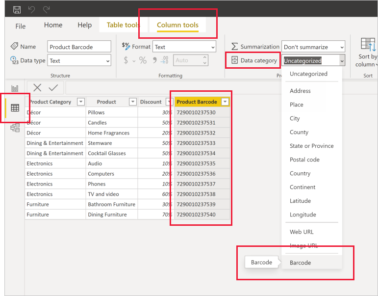

# Tag barcodes in Power BI Desktop for use in the mobile app

In Power BI Desktop, you can [categorize data](desktop-data-categorization.md) in a column, so Power BI Desktop knows how to treat values in visuals in a report. You can also categorize a column as **Barcode**. When someone in your company or organization [scans a barcode](../consumer/mobile/mobile-apps-scan-barcode-iphone.md) on a product using the Power BI mobile app on their iOS or Android phone or tablet, they'll see any report that includes that barcode. When they open the report, it will automatically be filtered to the data related to that barcode.

Assuming that you have a report that includes barcodes: 

1. In Power BI Desktop, switch to Data view.
2. Select the column that contains the barcode data. See the list of [supported barcode formats](#supported-barcode-formats) below.
3. On the **Column tools** tab, select **Data Category** > **Barcode**.
   
    

    >[!WARNING]
    >Do not categorize more than one column across all data tables in a report as **Barcode**. The mobile apps support Barcode filtering only for reports that have only one barcode column across all report data tables. If a report has more than one barcode column, no filtering takes place.

4. In Report view, add the barcode field to the visuals you want filtered by the barcode.
5. Save the report and publish it to the Power BI service.

Now when you open the scanner on the Power BI apps for iOS and Android phones and tablets and scan a barcode, you see this report in the list of reports. When you open the report, its visuals are filtered by the product barcode you scanned.

## Supported barcode formats
These are the barcode formats Power BI recognizes if you can tag them in a Power BI report: 

* UPCECode 
* Code39Code  
* A39Mod43Code 
* EAN13Code 
* EAN8Code  
* 93Code  
* 128Code 
* PDF417Code 
* Interleaved2of5Code 
* ITF14Code 

## Next steps
* [Scan a barcode from the Power BI app on your iOS or Android phone or tablet](../consumer/mobile/mobile-apps-scan-barcode-iphone.md)
* [Issues with scanning barcodes](../consumer/mobile/mobile-apps-scan-barcode-iphone.md#issues-with-scanning-a-barcode)
* [Data categorization in Power BI Desktop](desktop-data-categorization.md)  
* Questions? [Try asking the Power BI Community](https://community.powerbi.com/)
