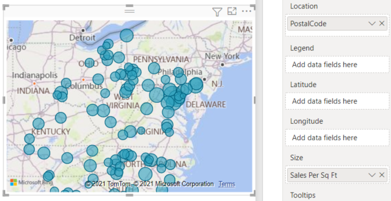
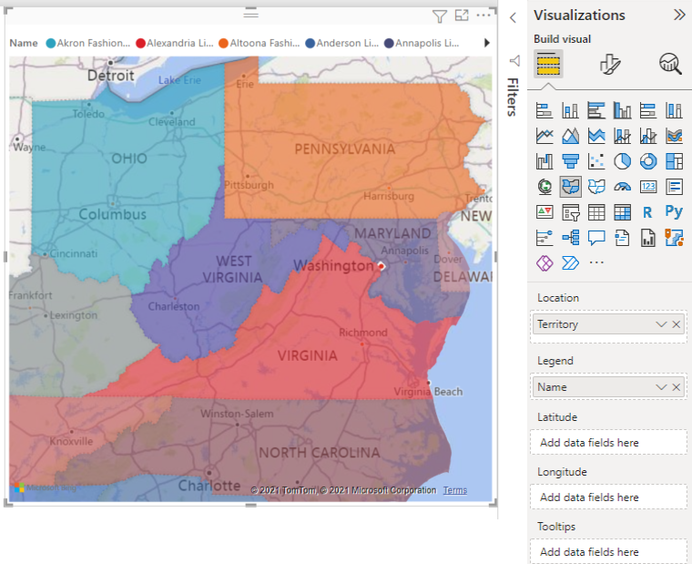
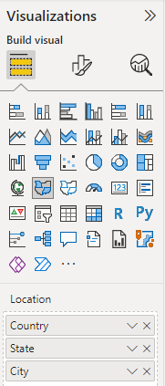
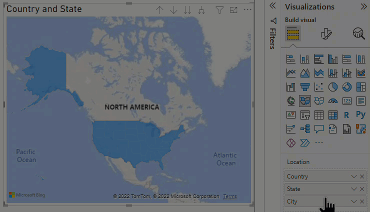

# Tips and tricks for Power BI map visualizations

[!INCLUDE[consumer-appliesto-nyyn](../includes/consumer-appliesto-nyyn.md)]    

Power BI integrates with Bing Maps to provide default map coordinates (a process called geo-coding) so you can create maps. Together they use algorithms to identify the correct location, but sometimes it's a best guess. If Power BI tries, but can't create the map visualization on its own, it enlists the help of Bing Maps. 

You, or your administrator, may need to update your firewall to allow access to the URLs Bing uses for geocoding.  Those URLs are:
* https://dev.virtualearth.net/REST/V1/Locations
* https://platform.bing.com/geo/spatial/v1/public/Geodata
* https://www.bing.com/api/maps/mapcontrol

To increase the likelihood of correct geo-coding, use the following tips. The first set of tips is for you to use if you have access to the dataset itself. The second set of tips is things you can do in Power BI if you don't have access to the dataset. 

## What is sent to Bing Maps?
The Power BI service and Power BI Desktop send Bing the geo data it needs to create the map visualization. This may include the data in the **Location**, **Latitude**, and **Longitude** buckets of the visual's field well. Exactly what is sent varies by map type. To learn more, see [Bing Maps privacy](https://go.microsoft.com/fwlink/?LinkID=248686).

* For maps (bubble, scatter, and dot plot maps), if latitude and longitude are provided, then no data is sent to Bing. Otherwise, any data in the **Location** bucket is sent to Bing.     

* Filled maps require a field in the **Location** bucket; even if latitude and longitude are provided. Whatever data is in the **Location**, **Latitude**, or **Longitude** bucket is sent to Bing.
  
    In the example below, the field **Vendor** is being used for geo-coding, so the values in the Vendor column are sent to Bing. Data from the **Size** and **Color saturation** buckets is not sent to Bing.
  
    
  
    In this second example below, the field **Territory** is being used for geo-coding, so the values in the Territory column are sent to Bing. Data from the **Legend** and **Color saturation** buckets is not sent to Bing.
  
    

## In the dataset: tips to improve the underlying dataset
If you have access to the dataset that is being used to create the map visualization, there are a few things you can do to increase the likelihood of correct geo-coding.

**1. Categorize geographic fields in Power BI Desktop**

In Power BI Desktop, you can ensure fields are correctly geo-coded by setting the *Data Category* on the data fields. In Data view, select the desired column. From the ribbon, select the **Modeling** tab and then set the **Data Category** to **Address**, **City**, **Continent**, **Country/Region**, **County**, **Postal Code**, **State** or **Province**. These data categories help Bing correctly encode the date. To learn more, see [Data categorization in Power BI Desktop](../transform-model/desktop-data-categorization.md). If you are live connecting to SQL Server Analysis Services, you will need to set the data categorization outside of Power BI using [SQL Server Data Tools (SSDT)](/sql/ssdt/download-sql-server-data-tools-ssdt).

**2. Use more than one location column.**    
 Sometimes, even setting the data categories for mapping isn't enough for Bing to correctly guess your intent. Some designations are ambiguous because the location exists in multiple countries or regions. For example, there's a ***Southampton*** in England, Pennsylvania, and New York.

Power BI uses Bing's [unstructured URL template service](/bingmaps/rest-services/locations/find-a-location-by-address) to get the latitude and longitude coordinates based on a set of address values for any country. If your data doesn't contain enough location data, add those columns and categorize them appropriately.

 For example, if you only have a City column, Bing may have a hard time geo-coding. Add additional geo columns to make the location unambiguous.  Sometimes all it takes is adding one more location column to the dataset - in this case state/province. And don't forget to categorize it properly, see #1 above.

Make sure each field only has a single location category. For example, your City location field should be **Southampton**, not **Southampton, New York**.  And Address location fields should be **1 Microsoft Way** and not **1 Microsoft Way, Redmond, WA**.

**3. Use specific Latitude and Longitude**

Add latitude and longitude values to your dataset. This removes any ambiguity and returns results more quickly. Latitude and Longitude fields must be in *Decimal Number* format, which you can set in the data model.

<iframe width="560" height="315" src="https://www.youtube.com/embed/ajTPGNpthcg" frameborder="0" allowfullscreen></iframe>

**4. Use Place category for columns with full location information**

While we encourage you to use geo-hierarchies in your maps, if you must use a single location column with full geographical information, you can set the data categorization to **Place**. For example, if the data in your column is full addresses, such as 1 Microsoft Way, Redmond Washington 98052, this generalized data category will work best with Bing. 

## In Power BI: tips to get better results when using map visualizations
**1. Use latitude and longitude fields (if they exist)**

In Power BI, if the dataset you are using has fields for longitude and latitude -- use them!  Power BI has special buckets to help make the map data unambiguous. Just drag the field that contains your latitude data into the **Visualizations > Latitude** area.  And do the same for your longitude data. When you do this, you also need to fill the *Location* field when creating your visualizations. Otherwise, the data is aggregated by default, so for example, the latitude and longitude would be paired at the state level, not the city level.

 

## Use geo-hierarchies so you can drill down to different "levels" of location
When your dataset already has different levels of location data, you and your colleagues can use Power BI to create *geo-hierarchies*. To do this, drag more than one field into the **Location** bucket. Used together in this way, the fields become a geo-hierarchy. In the example below we have added geo fields for: Country/Region, State, and City. In Power BI you and your colleagues can drill up and down using this geo-hierarchy.

  

   

When drilling with geo-hierarchies, it is important to know how each drill button works and what gets sent to Bing Maps. 

* The drill button on the far right, called Drill Mode  , allows you to select a map Location and drill down into that specific location one level at a time. For example, if you turn Drill Down on and click North America, you move down in the hierarchy to the next level -- states in North America. For geo-coding, Power BI sends Bing Maps country and state data for North America only.  
* On the left there are 2 other drill options. The first option,  , drills to the next level of the hierarchy for all locations at once. For example, if you are currently looking at countries and then use this option to move to the next level, states, Power BI displays state data for all countries. For geo-coding, Power BI sends Bing Maps state data (no country data) for all locations. This option is useful if each level of your hierarchy is unrelated to the level above it. 
* The second option,  , is similar to Drill Down, except that you don't need to click on the map.  It expands down to the next level of the hierarchy remembering the current level's context. For example, if you are currently looking at countries and select this icon, you move down in the hierarchy to the next level -- states. For geo-coding, Power BI sends data for each state and its corresponding country to help Bing Maps geocode more accurately. In most maps, you will use either this option or the Drill Down option on the far right, so you can send Bing as much information as possible to get accurate location information. 

## Next steps
[Drill down in a Power BI visualization](../consumer/end-user-drill.md)

[Power BI visualizations](power-bi-report-visualizations.md)

More questions? [Try the Power BI Community](https://community.powerbi.com/)