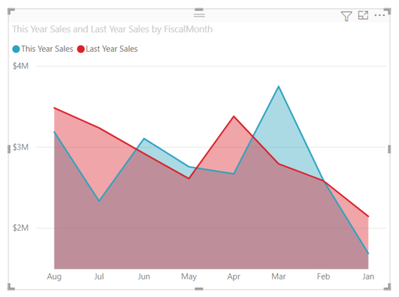

# Add visuals to a Power BI report (part 2)

[!INCLUDE [applies-yes-desktop-yes-service](../includes/applies-yes-desktop-yes-service.md)]

In [Part 1](power-bi-report-add-visualizations-i.md), you created a basic visualization by selecting checkboxes next to field names.  In Part 2, you'll learn how to use drag-and-drop and make full use of the **Fields** and **Visualizations** panes to create and modify visualizations.

## Create a new visualization
In this tutorial, we'll dig into our Retail Analysis dataset and create a few key visualizations.

## Prerequisites

This tutorial uses the [Retail analysis sample PBIX file](https://download.microsoft.com/download/9/6/D/96DDC2FF-2568-491D-AAFA-AFDD6F763AE3/Retail%20Analysis%20Sample%20PBIX.pbix).

1. From the upper left section of the Power BI Desktop menu bar, select **File** > **Open**
   
2. Find your copy of the **Retail Analysis sample PBIX file**

1. Open the **Retail Analysis sample PBIX file** in report view .

1. Select  to add a new page.

## Add visualizations to the report

Create a visualization by selecting a field from the **Fields** pane. The type of visualization created will depend on the type of field selected. Power BI uses the data type to determine which visualization to use to display the results. You can change the visualization used by selecting a different icon from the Visualizations pane. Keep in mind that not all visualizations can display your data. For example, geographic data will not display well using a funnel chart or line chart. 

### Add an area chart that looks at this year's sales compared to last year

1. From the **Sales** table, select **This Year Sales** > **Value** and **Last Year Sales**. Power BI creates a column chart.  This chart is interesting, and you want to dig deeper. What do the sales look like by month?  
   
   

2. From the Time table, drag **FiscalMonth** into the **Axis** area.  
   

3. [Change the visualization](power-bi-report-change-visualization-type.md) to an area chart.  There are many visualization types to choose from - see [descriptions of each, tips for best practices, and tutorials](power-bi-visualization-types-for-reports-and-q-and-a.md) for help with deciding which type to use. From the Visualizations pane, select the area chart icon .

4. Sort the visualization by selecting **More actions** (...) and choosing **Sort by** >  **FiscalMonth**.

5. [Resize the visualization](power-bi-visualization-move-and-resize.md) by selecting the visualization, grabbing one of the outline circles and dragging. Make it wide enough to eliminate the scrollbar and small enough to give us enough room to add another visualization.
   
   
6. Save the report.

### Add a map visualization that looks at sales by location

1. From the **Store** table, select **Territory**. Drag **Total Stores** into the Size area. Power BI recognizes that Territory is a location, and creates a map visualization.  
   

2. Add a legend.  To see the data by store name, drag **Store** > **Chain** into the Legend area.  
   

> [!NOTE]
> Sharing your report with a Power BI colleague requires that you both have individual Power BI Pro licenses or that the report is saved in Premium capacity. See [sharing reports](../collaborate-share/service-share-reports.md).

## Next steps
* More about [Visualizations in Power BI reports](power-bi-report-visualizations.md).  
* More questions? [Try the Power BI Community](https://community.powerbi.com/)

