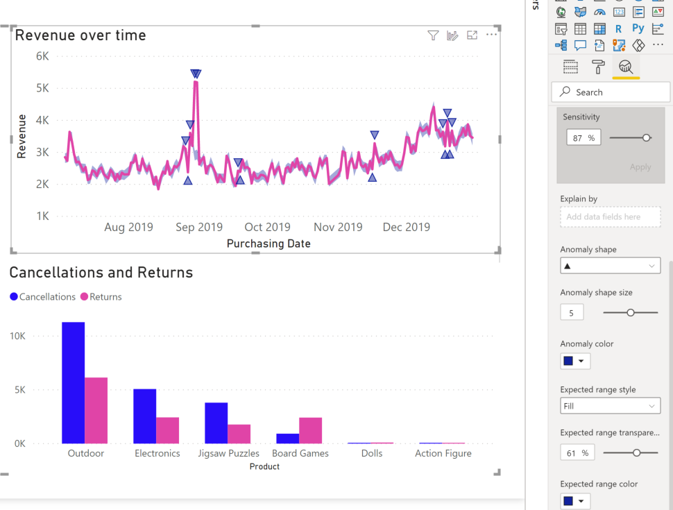
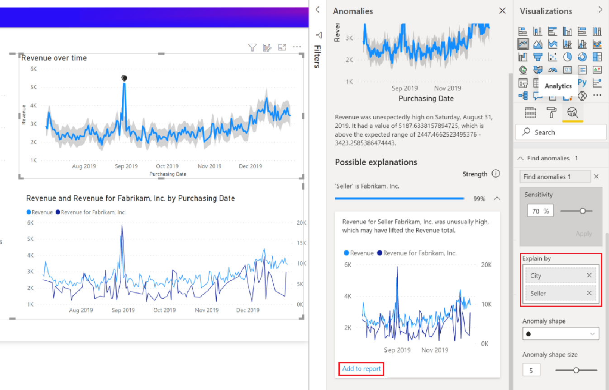

# Anomaly detection (preview)

[!INCLUDE[consumer-appliesto-nyyn](../includes/consumer-appliesto-nyyn.md)]    

Anomaly detection helps you enhance your line charts by automatically detecting anomalies in your time series data. It also provides explanations for the anomalies to help with root cause analysis.  With just a couple of clicks, you can easily find insights without slicing and dicing the data. You can create and view anomalies in both Power BI Desktop and the Power BI service. The steps and illustrations in this article are from Power BI Desktop.

 [!VIDEO https://www.microsoft.com/videoplayer/embed/RE4M2hp]

This feature is in preview, so you first need to turn on the feature switch. Go to **File** > **Options and Settings** > **Options** > **Preview features**, and make sure **Anomaly detection** is turned on:

:::image type="content" source="media/power-bi-visualization-anomaly-detection//preview-feature-switch.png" alt-text="Screenshot showing how to enable Anomaly detection preview feature switch.":::
 
## Get started
This tutorial uses online sales data for various products.To follow along with this tutorial, download the [sample file](https://github.com/microsoft/powerbi-desktop-samples/blob/main/Monthly%20Desktop%20Blog%20Samples/2020/2020SU09%20Blog%20Demo%20-%20September.pbix) of an online-sales scenario.

You can enable Anomaly detection by selecting the chart and adding "Find Anomalies" option in the analytics pane. 

 

 For example, this chart shows Revenue over time. Adding anomaly detection automatically enriches the chart with anomalies, and the expected range of values. When a value goes outside this expected boundary, it's marked as an anomaly. Check out this [technical blog](https://techcommunity.microsoft.com/t5/ai-customer-engineering-team/overview-of-sr-cnn-algorithm-in-azure-anomaly-detector/ba-p/982798) for more details about the Anomaly Detector algorithm.

 
 
## Format anomalies

This experience  is highly customizable. You can format the anomaly's shape, size, and color, and also the color, style, and transparency of expected range. You can also configure the parameter of the algorithm.  If you increase the sensitivity, the algorithm is more sensitive to changes in your data. In that case, even a slight deviation is marked as an anomaly. If you decrease the sensitivity, the algorithm is more selective on what it considers an anomaly.

 
 
## Explanations
Besides detecting anomalies, you can also automatically explain the anomalies the data. When you select the anomaly, Power BI runs an analysis across fields in your data model to figure out possible explanations. It gives you a natural language explanation of the anomaly, and factors associated with that anomaly, sorted by its explanatory strength. Here I see that on August 30, Revenue was $5187, which is above the expected range of $2447 to $3423. I can open the cards in this pane to see more details of the explanation.

 
### Configure explanations
You can also control the fields that are used for analysis. For example, by dragging Seller and City into the **Explain by** field well, Power BI restricts the analysis to just those fields. In this case,  the anomaly on August 31 seems to be associated with a particular seller and particular cities. Here, seller "Fabrikam" has a strength of 99%. Power BI calculates *strength* as the ratio of the deviation from expected value, when filtered by the dimension to the deviation in total value. For example, it's the ratio of actual minus expected value, between the component time series *Fabrikam* and the aggregate time series *overall Revenue* for the anomaly point. Opening this card shows the visual with a spike in the revenue for this seller on August 31. Use the **Add to report** option to add this visual to the page.

## Limitations
- Anomaly detection is only supported for line chart visuals containing time series data in the Axis field.
- Anomaly detection isn't supported with legends, multiple values or secondary values in line chart visual.
- Anomaly detection requires at least 12 data points.
- Forecast/Min/Max/Average/ Median/Percentile lines doesn't work with Anomaly detection.
- Direct Query over SAP data source, Power BI Report Server, Live Connection to Azure Analysis Services and SQL Server Analysis Services aren't supported.
- Anomaly Explanations doesn't work with 'Show Value As' options.
- Drilling down to go to the next level in the hierarchy isn't supported.

## Next steps
To learn more about the algorithm that runs anomoly detection, see [Tony Xing's post on the SR-CNN algorithm in Azure Anomoly Detector](https://techcommunity.microsoft.com/t5/ai-customer-engineering-team/overview-of-sr-cnn-algorithm-in-azure-anomaly-detector/ba-p/982798)