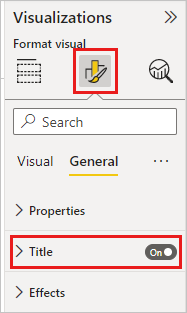
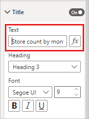
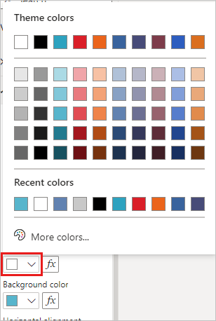
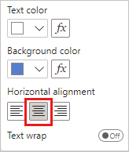
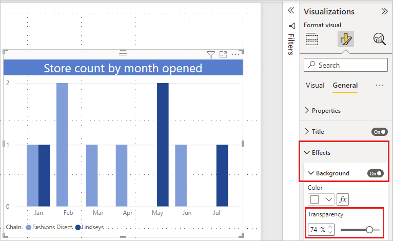
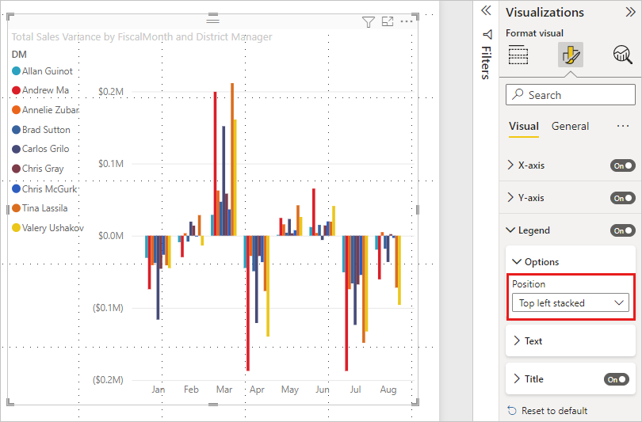
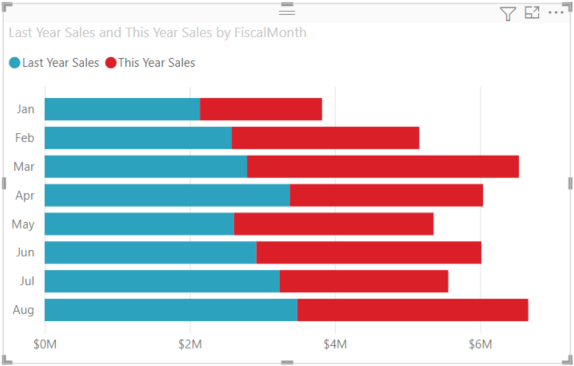
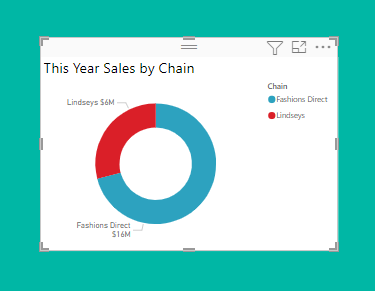
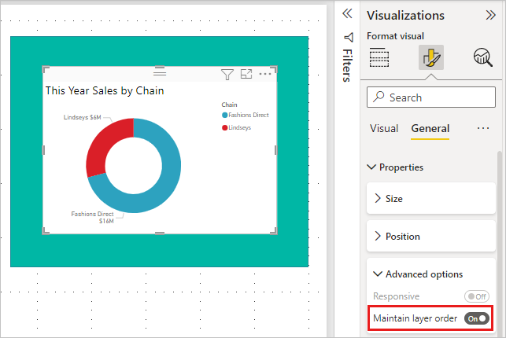
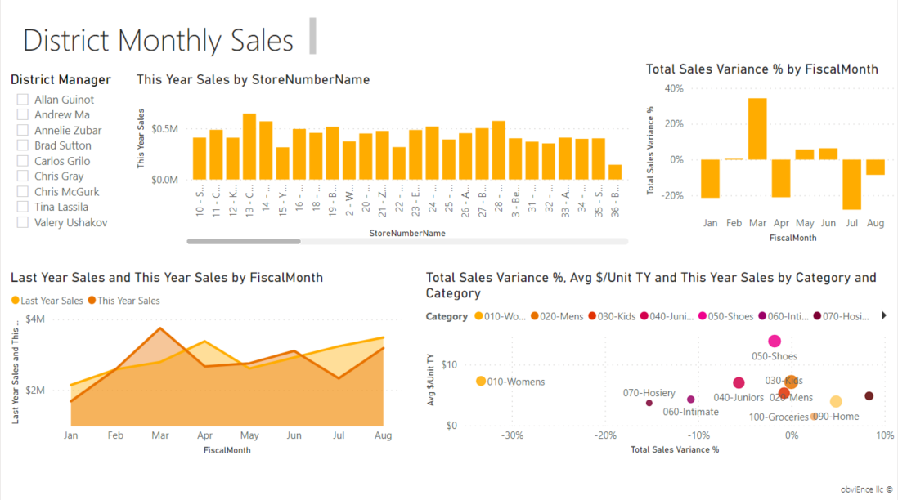

# Customize visualization titles, backgrounds, labels, and legends

[!INCLUDE[consumer-appliesto-nyyn](../includes/consumer-appliesto-nyyn.md)]

In this tutorial, you'll learn a few different ways to customize your visualizations. There are so many options for customizing your visualizations. The best way to learn about them all is by exploring the **Format** pane (select the paint roller icon). To get you started, this article shows you how to customize a visualization title, legend, background, label, layer, and add a theme.

You can't customize all visualizations. See the [complete list](#visualization-types-that-you-can-customize) of visualizations for details.

## Prerequisites

- The Power BI service or Power BI Desktop

- Retail Analysis Sample report

> [!NOTE]
> Sharing your report with a Power BI colleague requires that you both have individual Power BI Pro licenses or that the report is saved in Premium capacity. See [sharing reports](../collaborate-share/service-share-reports.md).

## Customize visualization titles in reports

To follow along, sign into Power BI Desktop and open the [Retail Analysis Sample](../create-reports/sample-datasets.md) report.

> [!NOTE]
> When you pin a visualization to a dashboard, it becomes a dashboard tile. You can also customize the tiles themselves with [new titles and subtitles, hyperlinks, and resizing](../create-reports/service-dashboard-edit-tile.md).

1. Go to the **New Stores** page of the **Retail Analysis Sample** report.

1. Select the **Open Store Count by Open Month and Chain** clustered column chart.

1. In the **Visualizations** pane, select the paint roller icon to reveal the format options.

1. Select **Title** to expand that section.

   

1. Move the **Title** slider to **On**.

1. To change the title, enter *Store count by month opened* in the **Title text** field.

    

1. Change **Font color** to white and **Background color** to blue.

    a. Select the drop-down and choose a color from **Theme colors**, **Recent colors**, or **Custom color**.

    

    b. Select the drop-down to close the color window.

1. Increase the text size to **16 pt**.

1. The last customization you'll make to the chart title is to align it in the center of the visualization.

    

    At this point in the tutorial, your clustered column chart title will look something like this:

    

Save the changes you've made and move to the next section.

If you ever need to revert all of the changes, select **Revert to default**, at the bottom of the **Title** customization pane.

## Customize visualization backgrounds

With the same clustered column chart selected, expand the **Background** options.

1. Move the **Background** slider to **On**.

1. Select the drop-down and choose a grey color.

1. Change **Transparency** to **74%**.

At this point in the tutorial, your clustered column chart background will look something like this:

Save the changes you've made and move to the next section.

If you ever need to revert all of the changes, select **Revert to default**, at the bottom of the **Background** customization pane.

## Customize visualization legends

1. Open the **Overview** report page and select the **Total Sales Variance by FiscalMonth and District Manager** chart.

1. In the **Visualization** tab, select the paint roller icon to open the Format pane.

1. Expand the **Legend** options:

    

1. Move the **Legend** slider to **On**.

1. Move the legend to the left side of the visualization.

1. Add a legend title by toggling **Title** to **On**.

1. Enter *Manager* in the **Legend name** field.

1. Change **Color** to black.

Save the changes you've made and move to the next section.

If you ever need to revert all of the changes, select **Revert to default**, at the bottom of the **Legend** customization pane.

## Customize total labels for stacked visuals

Stacked visuals can display data labels and total labels. On a stacked column chart, data labels identify the value for each portion of a column. Total labels display the total value for the entire aggregated column. 

Watch Rien add total labels to a stacked chart, and then follow the steps below to try it out yourself.

> [!VIDEO https://www.youtube.com/embed/OgjX-pFGgfM]

1. Open the **Overview** report page and select the **Average selling area size by chain and store type** bar chart.

1. In the **Visualization** tab, select  to convert this bar chart to a stacked bar chart. Notice that the visual retains its data labels.

    

1. In the **Visualization** tab, select the paint roller icon to open the Format pane.

1. Move the **Total labels** slider to **On**. 

    

1. Optionally, format the total labels. In this example, we've changed color to black, increased font size, and opted to display the values as **Thousands**.

    

## Customize layer order

Change the layering order of visuals and shapes in your reports. Layer order determines which objects will come to the front when selected. Whenever you select an object on the report canvas, it becomes active and moves to the top layer. For visuals, this makes it easier to interact with the selected visual. But, for shapes and backgrounds, you may want to secure them to the bottom layer, so that you can't accidentally select them and cover or obscure your report visuals. 

Layering controls are available in the Power BI service, Power BI Desktop, mobile, and Report server. This article shows you how to change layer order behavior in the Power BI service.

Watch Rien change layer order behavior, and then follow the steps below to try it out yourself.

> [!VIDEO https://www.microsoft.com/videoplayer/embed/RE4IY3L]

1. Add a new report page by selecting the yellow plus sign.

1. Add a shape to the canvas. Here, we've added a blue rectangle.

    

1. Copy-paste a visual from another page in the report.

    

    Now that you have 2 layers, try selecting the pie chart and then the background. When you select the pie chart, Power BI makes that object active and displays its header menu. When you select the rectangle, Power BI makes that object active and brings it to the front where it obscures the pie chart. You can change this default behavior.

1. Select the rectangle and open the Formatting pane. Expand **General** and locate the **Maintain layer order** toggle. Save the report changes and switch to Reading view.

    

1. In Reading view, when you select the blue rectangle, it stays in the back layer.

## Customize colors using a theme

With report themes you can apply design changes to your entire report, such as using corporate colors, changing icon sets, or applying new default visual formatting. When you apply a report theme, all visuals in your report use the colors and formatting from your selected theme.

To apply a theme to your report, select **Switch theme** from the menu bar. Choose a theme.  The report below uses the **Solar** theme.

## Visualization types that you can customize

Here is a list of the visualizations and the customization options that are available for each:

| Visualization | Title | Background | Legend | Total labels
|:--- |:--- |:--- |:--- |:--- |
| Area | yes | yes |yes | yes  |
| Bar | yes | yes |yes | yes |
| Card | yes | yes |n/a | n/a |
| Multi-row Card | yes | yes | n/a | n/a |
| Column | yes | yes | yes |  yes |
| Combo | yes | yes | yes | yes |
| Donut | yes | yes | yes | n/a |
| Filled map | yes | yes | yes |n/a |
| Funnel | yes | yes | n/a |n/a |
| Gauge | yes | yes | n/a |n/a |
| Key Influencer | yes | yes | n/a |n/a |
| KPI | yes | yes | n/a |n/a |
| Line | yes | yes | yes |n/a |
| Map | yes | yes | yes |n/a |
| Map: [Azure Map](/azure/azure-maps/power-bi-visual-getting-started?context=/power-bi/create-reports/context/context) | yes | yes | yes |n/a |
| Matrix | yes | yes | n/a |yes |
| Pie | yes | yes | yes |n/a |
| Q&A | yes | yes | n/a |n/a |
| Scatter | yes | yes | yes |n/a |
| Shape | yes | yes | yes |n/a |
| Slicer | yes | yes | n/a |n/a |
| Table | yes | yes | n/a |yes |
| Textbox | no | yes | n/a |n/a |
| Treemap | yes | yes | yes |n/a |
| Waterfall | yes | yes | yes |n/a |

## Next steps

- [Customize X-Axis and Y-Axis properties](power-bi-visualization-customize-x-axis-and-y-axis.md)

- [Getting started with color formatting and axis properties](service-getting-started-with-color-formatting-and-axis-properties.md)

More questions? [Try the Power BI Community](https://community.powerbi.com/)
